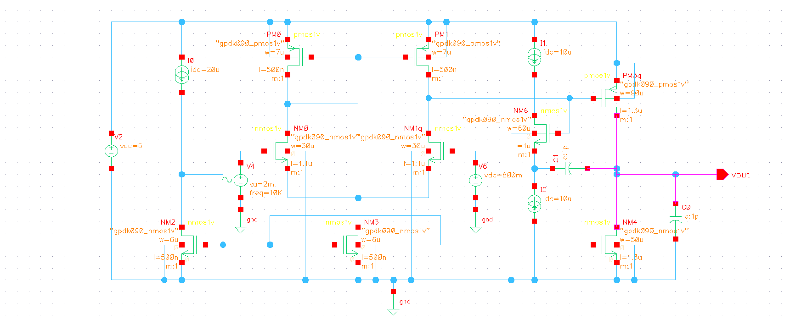
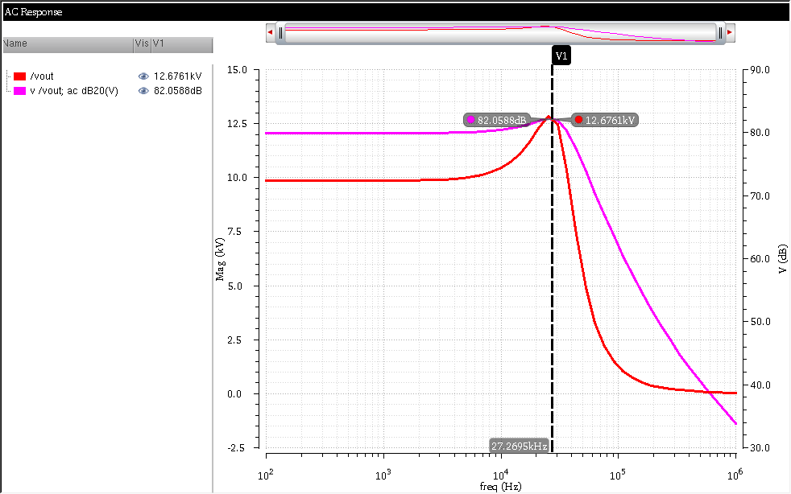
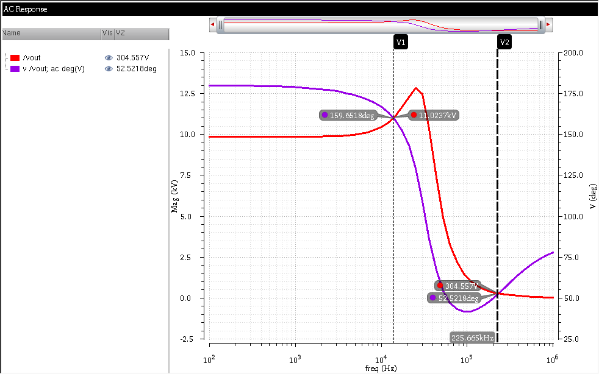
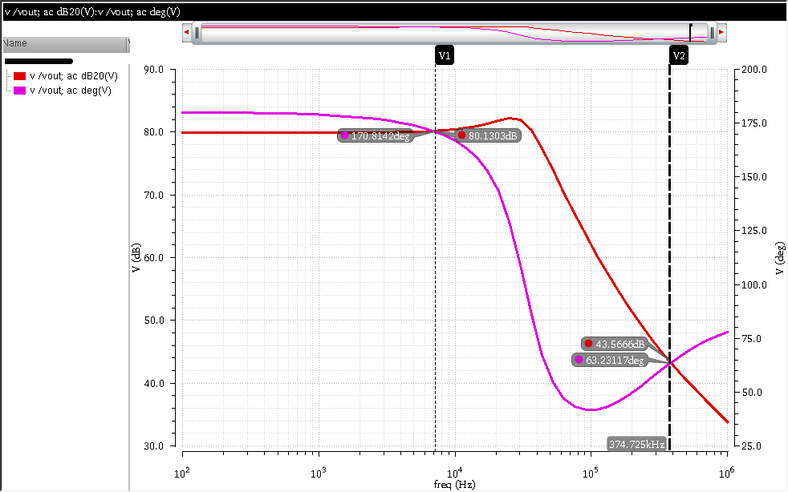
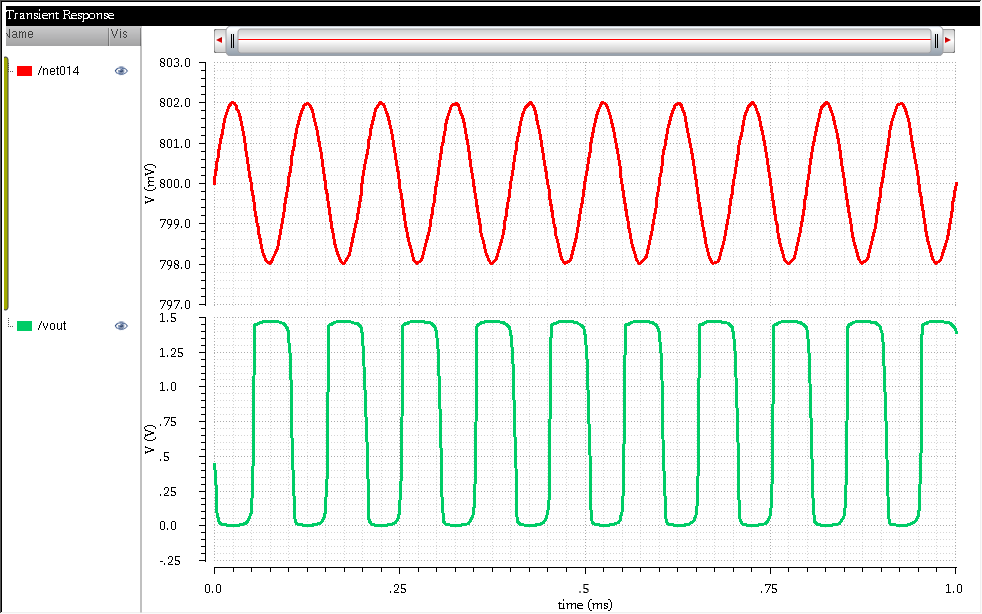
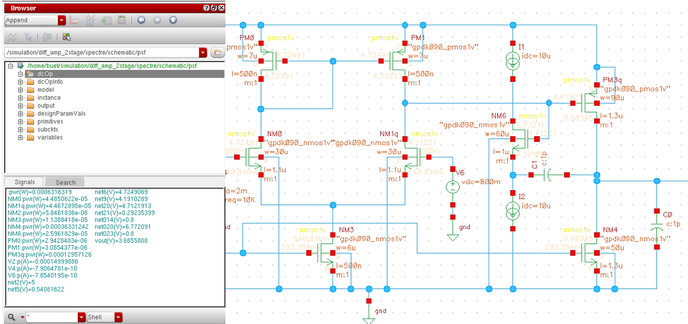

# 🎯 Low-Power Two-Stage CMOS Op-Amp Design

---

## 📌 Overview
This project focuses on the design and analysis of a **two-stage CMOS operational amplifier** optimized for **high gain, stability, and low power consumption**.

The design uses **Miller compensation** to ensure stability and achieves strong performance in terms of gain and phase margin.

---

## 🎯 Specifications

| Parameter            | Value        |
|---------------------|-------------|
| Gain                | ~85 dB      |
| Phase Margin        | ~65°        |
| Power Consumption   | ~0.85 mW    |
| Technology          | 90nm CMOS   |

---

## 🛠 Tools Used
- Cadence Virtuoso  
- LTSpice  

---

## ⚙️ Design Architecture
- Differential input stage with active load  
- Gain-boosted second stage  
- Miller compensation for stability  
- Optimized transistor sizing for low power  

---

## 📊 Results

### 🔹 Schematic

---

### 🔹 Gain Response

---

### 🔹 Phase Margin

---

### 🔹 Gain vs Phase

---

### 🔹 Transient Response

---

### 🔹 Power Analysis

---

## 📘 Project Report
📄 [View Detailed Report](OP_AMP_PROJECT_REPORT.pdf)

---

## 🧠 Key Learnings
- Stability analysis using **phase margin**
- Trade-offs between **gain, bandwidth, and power**
- Importance of **compensation techniques**
- Basics of **layout-aware analog design**

---

## 🚀 Future Scope
- Full **layout design and parasitic extraction**
- Post-layout simulation  
- Further **power and area optimization**

---

## 👨‍💻 Author
**K L V N Rajkumar**  
Aspiring Analog Layout Engineer | VLSI Enthusiast  

---

## ⭐ Support
If you found this useful, consider giving it a ⭐ on GitHub!
